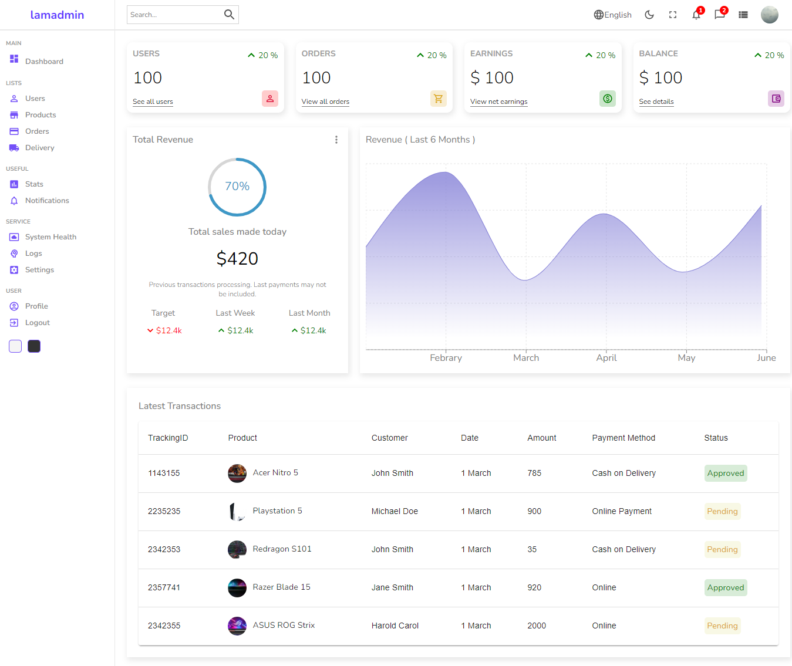

# 02 - Typealong React Admin Panel

## Table of contents

- [Overview](#overview)
  - [Screenshot](#screenshot)
  - [Links](#links)
- [My process](#my-process)
  - [Built with](#built-with)
  - [Conclusion](#conclusion)
  - [Useful resources](#useful-resources)

## Overview

### Screenshot

### Links

- Live Site URL: [Click here](https://02-typealong-react-admin-panel-tutorial.netlify.app/users/new)

## My process

### Built with

- [React](https://reactjs.org/) - JS library
- [React Router DOM](https://reactrouter.com/) - React routing library
- [Material UI](https://mui.com/) - React Component library

### Conclusion

- Had a try at Material UI library and it ease up the development process.
- React Router DOM is quite easy to use and learn.
- Implemented dark mode using useContext at App component so that all components are able to access the state of dark mode.

### Useful resources

- Source Tutorial: [Click here](https://www.youtube.com/watch?v=yKV1IGahXqA)
